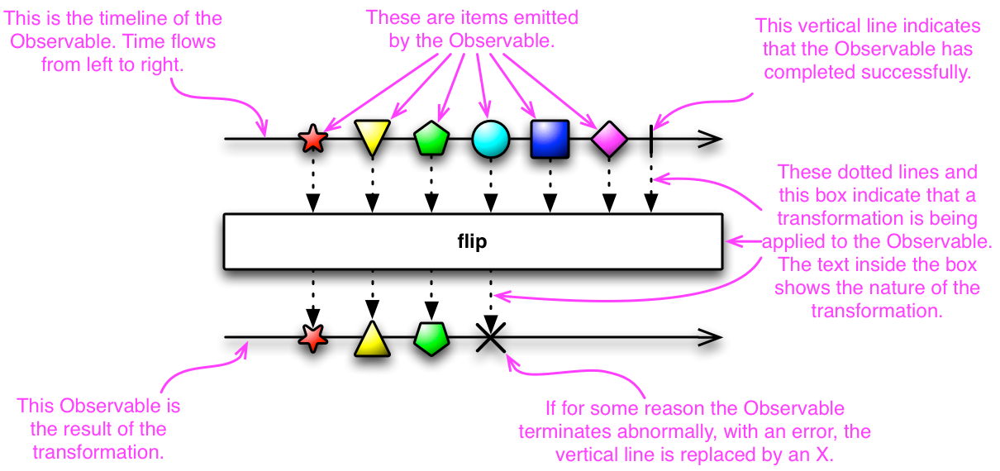

# 리액티브 프로그래밍

## 정의

- **변화의 전파**와 **데이터의 흐름**과 관련된 선언적 프로그래밍 패러다임이다.
    - 변화의 전파와 데이터의 흐름 : 데이터가 변경 될 때마다이벤트를 발생시켜서 데이터를 계속적으로 전달한다.-
    - 선언적 프로그래밍 : 실행할 동작을 구체저그올 명시하는 명령형 프로그래밍과 달리 선언형 프로그래밍은 단순히 목표를 선언한다.

## 리액티브 적용 예시

- Push 방식의 변화의 전파 & 데이터의 흐름
    - Mobile App의 Push
    - Spring ApplicationEventPublisher

## 기본 개념

### Observable

- 지속적으로 변경이 가능한 데이터의 집합
- 변경을 관찰할 수 있다는 의미

### Operators

- Observable을 처리하는 함수

### Scheduler

- 리액티브 프로그래밍의 기초는 비동기 프로그래밍인데 비동기에 활용할 쓰레드를 관리하는 관리자

### Subscriber

- Observable이 발행하는 데이터를 구독하는 구독자

## 마블 다이어그램

### 정의

- 리액티브 프로그래밍을 통해 발생하는 **비동기적인 데이터의 흐름을 시간의 흐름**에 따라 시각적으로 표시한 다이어그램
    - 리액티브 연산자에 대한 쉬운 이해를 위해 알면 좋음

### 해석 방법

- 상단 타임라인 : 상단에 존재하는 선으로서 시간의 흐름에 따른 데이터 발행을 의미한다.
- 데이터 in 상단 타임라인 : Observable이 발행하는 데이터
- 파이프 in 상단 타임라인 : 데이터 발행의 종료
- Operator : 중단에 존재하는 연산자
- 하단 타임라인 : 하단에 존재하는 선으로 발행된 데이터가 함수를 거쳐 변환되는 과정을 의미한다.
- 데이터 in 하단 타임라인 : 함수의 출력으로 나온 변환된 데이터
